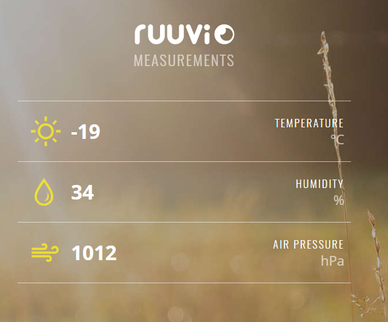

# Sensor Protocol for Eddystone-URL

This specification is designed to offer simple and flexible way to broadcast different type of sensor values in an [Eddystone-URL](https://github.com/google/eddystone/tree/master/eddystone-url) frame. One possible usage scenario would be:
> [RuuviTag](http://ruuvitag.com) sensor beacon broadcasts an encoded URL address in an Eddystone-URL frame: `http://ruu.vi#AjAYAMLs`. Once user visits the link, **ruu.vi** website decodes the value `AjAYAMLs` and shows the data in a human-readable format.  Please note that ruu.vi website rounds the data. 
The website implemetation is online at it's own [github repository](https://github.com/ruuvi/weather-station-serverside).

The data part of the URL can be encoded in firmware of the beacon. The most powerful way to encode the data would be Base94 because the URL field of the Eddystone-URL has a support for 94 different characters. Normally it's mandatory to encode the data because of maximum length (18 characters) of the [Eddystone-URL](https://github.com/google/eddystone/tree/master/eddystone-url) frame's URL field. We are using [URL-safe Base64](https://tools.ietf.org/html/rfc4648#page-7) for support across as many devices as possible.

## Protocol Specification (Data Format 2 and 4)

The decoded data URL parameter is a packet of bytes.

Offset | Allowed values | Description
-----|:-----:|-----------
 0 | 4 | Data format definition (4 = current sensor readings)
 1 | `0 ... 200` | Humidity (one lsb is 0.5%, e.g. 128 is 64%)
 2 | `-127 ... 127, signed` | Temperature (MSB is sign, next 7 bits are decimal value)
 3 | `0 ... 0` | Temperature (fraction, 1/100.). Not used, reads always as 0.
 4 - 5| `0 ... 65535` | Pressure (Most Significant Byte first, value - 50kPa). Rounded to 1 hPa accuracy.
 6 | `0..255` | Random id of tag, only present in format 4. NOTE! because of the URL limitation, only 6 most significant bits will be readable. 

# Sensor Protocol for Sensor Tag
The plain Sensor Tag sends the data as Manufacturer specific data in undirected, non-connectable bluetooth advertisement. 

## Protocol Specification (Data Format 3)
The data is decoded from "Manufacturer Specific Data" -field, for more details please check [this article](https://github.com/ruuvi/ruuvi-sensor-protocols) out.
Manufacturer ID is 0xFFFF (not specified -  /TODO). 
The actual data payload is: 

Offset | Allowed values | Description
-----|:-----:|-----------
 0 | 3 | Data format definition (3 = current sensor readings)
 1 | `0 ... 200` | Humidity (one lsb is 0.5%, e.g. 128 is 64%)
 2 | `-127 ... 127, signed` | Temperature (MSB is sign, next 7 bits are decimal value)
 3 | `0 ... 99` | Temperature (fraction, 1/100.)
 4 - 5| `0 ... 65535` | Pressure (Most Significant Byte first, value - 50kPa)
 6-7 | `-32767 ... 32767, signed`  | Acceleration-X (Most Significant Byte first)
 8 - 9 | `-32767 ... 32767, signed`  | Acceleration-Y (Most Significant Byte first)
 10 - 11| `-32767 ... 32767, signed`  | Acceleration-Z (Most Significant Byte first)
 12 - 13| `0 ... 65535` | Battery voltage (millivolts). MSB First

# Data field descriptions
## Temperature
Values supported: -127.99 °C to +127.99 °C in 0.01 °C increments.
### Example
Value | Measurement
----|-----------
 `0x0000` | 0 °C
 `0x8145` | -1.45 °C
 `0x0145` | +1.45 °C

## Humidity
Values supported: 0.0 % to 100 % in 0.5 % increments.
### Example
Value | Measurement
----|-----------
 `000` | 0%
 `128` | 64.0%
 `200` | 100.0%

## Atmospheric Pressure
Values supported: 50000 Pa to 115536 Pa in 1 Pa increments.
### Example
Value | Measurement
----|-----------
 `00000` | 50000 Pa
 `41325` | 101325 Pa (average sea-level pressure)
 `65536` | 115536 Pa
 
## Acceleration
Values supported: -32000 to 32000 (mG), however the sensor on RuuviTag supports only 16 G max (2 G in default configuration).
Values are 2-complement int16_t, MSB first. All channels are identical.
### Example
Value | Measurement
----|-----------
 `0xFC 0x18` | -1000 mG
 `0x03 0xE8` | 1000 mG

## Battery voltage
### Sensortag
Values supported: 0 mV to 65536 mV in 1 mV increments, practically 1800 ... 3600 mV. 

## Tag ID
### Weather Station
Contains a single random base 64 character used to identify tag.
 
## Data Format
The first byte tells the receiver (ie. website) what kind of type of data the packet has.

Decimal | Description
----|-----------
 1 | Historical use, not supported anymore. 
 2 | Eddystone-URL, URL-safe base64 -encoded, kickstarter edition (no battery voltage)
 3 | BLE Manufacturer specific data, all current sensor readings at 1 second interval
 4 | Eddystone-URL, URL-safe base64 -encoded, with tag id.
 5 | Reserved for future use
 6 | Reserved for future use
 7 | Reserved for future use
 8 | Reserved for future use
 9 | Reserved for future use
 
 
